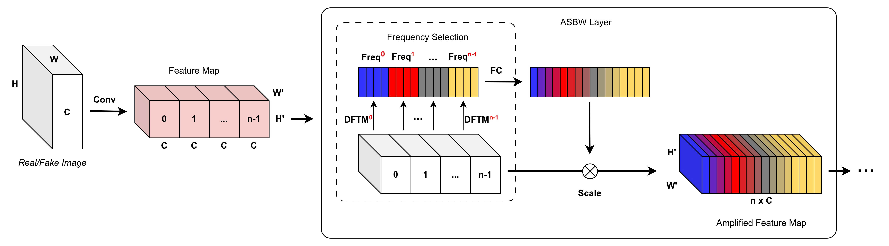
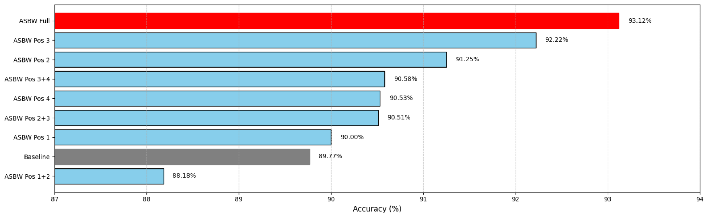

# ASBW: A Frequency-Domain Analysis Approach for Distinguishing GAN-Generated Images from Real Images

**Quang Huy Nguyen and Van Huy Pham**

## News
* **[03/2026]** Our presentation achieved the Outstanding Presentation Award.
* **[01/2026]** This research was accepted and selected for an oral presentation at The Digital Convergence in Economics, Society and Technology (DCEST 2026).

## Abstract
The rapid advancement of Generative Adversarial Networks (GANs) continues to challenge digital media integrity, while purely spatial-domain forensic models remain sensitive to overfitting and weakly generalizable artifacts. To address this, we propose the Adaptive Spectral-Band Weighting (ASBW) layer, a lightweight frequency-domain module that applies the Discrete Fourier Transform (DFT) and a compact Multi-Layer Perceptron (MLP) to reweight discriminative spectral cues caused by GAN generation. We evaluate ASBW insertion at different positions across the ResNet-18 pipeline (after each convolutional block), and compare these placement strategies with the baseline CNN. Results on the real/fake face benchmark show that ASBW effectiveness is strongly position-dependent: the full configuration achieves the best performance (**93.12%**), while placing ASBW after later blocks (e.g., Position 3: **92.22%**) consistently improves over the baseline (**89.77%**). These findings highlight that frequency-aware amplification is most beneficial when integrated with suitable feature hierarchy depth, and provide practical guidance for architecture design in GAN image forensics.

## Architecture



## Results



## Citation

If you find this work useful, please cite:

```bibtex
@inproceedings{nguyen2026asbw,
    title      = {ASBW: A Frequency-Domain Analysis Approach for Distinguishing GAN-Generated Images from Real Images},
    author     = {Quang Huy Nguyen and Van Huy Pham},
    booktitle  = {In Proceeding of the Digital Convergence in Economics, Society and Technology (DCEST) 2026 International Conference},
    year       = {2026},
    pages      = {95-105}
}
```

## Contact

- Quang Huy Nguyen: nguyenquanghuy.st@tdtu.edu.vn
- Van Huy Pham: huy.phamvan@umt.edu.vn